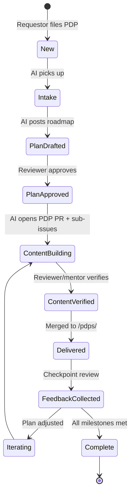

# PDP Workflow

Personal Development Plans use the same state machine as training requests,
but produce a longer-horizon asset under `/pdps/` and typically spawn multiple
linked Training Requests.

## State machine (same stages, PDP artifacts)

## Key differences vs. a single Training Request

| Aspect | Training Request | PDP |
| --- | --- | --- |
| Horizon | Days to weeks | 3–12 months |
| Artifact | `trainings/<slug>.md` | `pdps/<slug>.md` |
| Gate #1 | Reviewer approves plan | Reviewer (and optional mentor) approve roadmap |
| Gate #2 | SME verifies content | Reviewer verifies each milestone's deliverables |
| Feedback | Single form after delivery | Recurring checkpoint reviews logged in the PDP file |
| Sub-items | None | Multiple Training Requests linked from PDP |

## Checkpoints

A PDP is **active** (not complete) until its success metrics are met.
Reviewer and requestor meet at milestone checkpoints; notes go into the
PDP file's **Check-in log** table and into the issue as comments. Applying
`state:iterating` and adjusting the plan is normal and expected.

## Mentor (optional)

If the requestor asked for a mentor, the Reviewer proposes one during plan
approval. The mentor is added as an assignee on the issue and in the PDP
front-matter.
