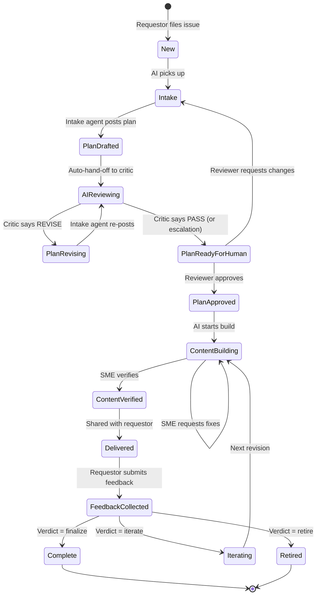

# Workflow

## State machine

> `PlanReadyForHuman` is the state `state:plan-drafted` + `needs:reviewer`
> reached only after the Critic Agent approves the draft against
> [.github/agents/plan-rubric.md](../.github/agents/plan-rubric.md).

## Stage details

### 1. New — Request filed
- **Who**: Requestor
- **How**: `Training Request` issue form
- **Label applied**: `state:new`

### 2. Intake — AI clarifies
- **Who**: AI Agent (via Copilot / Actions bot)
- **Does**: reads the form, asks 1–5 clarifying questions as an issue comment,
  tags `needs:requestor` if answers are missing.
- **Exit criterion**: enough context to draft a plan.
- **Label**: `state:intake`

### 3. Plan drafted — AI proposes a training plan
- Intake Agent posts a plan comment that copies the full **Plan
  Acceptance Form** from [docs/PLAN-ACCEPTANCE-FORM.md](PLAN-ACCEPTANCE-FORM.md)
  with every field filled in. Blank fields are rejected.
- **Label**: `state:plan-drafted` → immediately handed off as
  `state:ai-reviewing`.

### 3b. AI review — Critic Agent scores the plan
- **Who**: Critic Agent (see [.github/agents/critic-agent.md](../.github/agents/critic-agent.md))
- **Does**: scores the plan against each rubric dimension in
  [.github/agents/plan-rubric.md](../.github/agents/plan-rubric.md),
  posts a table with evidence, and issues one of:
  - **PASS** → promote to `state:plan-drafted` + `needs:reviewer` for a human.
  - **REVISE** → set `state:plan-revising`; Intake Agent addresses the
    numbered revision requests and re-posts.
  - **ESCALATE** (round 3+) → promote to human review with the critic
    history attached.
- **Cap**: 3 critic rounds; then escalate.

### 4. Plan approved — Human reviewer gate #1
- **Who**: Reviewer (training lead)
- **Does**: approves via comment `/approve-plan` or edits and re-approves.
- **Label**: `state:plan-approved`

### 5. Content building — AI drafts the asset
- AI produces a PR that adds a file under `/trainings/` using
  `trainings/_template.md`. Front-matter links back to the request issue.
- **Label**: `state:content-building`, `needs:sme`

### 6. Content verified — Human SME gate #2
- **Who**: SME
- **Does**: reviews the PR for accuracy, approves or requests changes.
- **Exit**: PR approved by SME.
- **Label**: `state:content-verified`

### 7. Delivered
- Maintainer merges the PR to `main`. Automation links the training asset
  back into the request issue and notifies the requestor.
- **Label**: `state:delivered`

### 8. Feedback collected
- Requestor opens a `Training Feedback` issue (linked to the request).
- **Label on request**: `state:feedback-collected`

### 9. Complete / Iterate / Retire
- Based on feedback verdict:
  - **Finalize** → `state:complete`, catalog entry confirmed, request closed.
  - **Iterate** → `state:iterating`, a new PR revises `/trainings/<file>`,
    loop back to stage 5.
  - **Retire** → `state:retired`, file removed or marked archived, request closed.

## Definition of Done

A training is **Complete** only when all are true:
- Training file exists in `/trainings/` and is approved by SME.
- `trainings/INDEX.md` lists it (auto-generated).
- A `Training Feedback` issue exists with verdict = Finalize.
- Original request issue is closed with `state:complete`.
